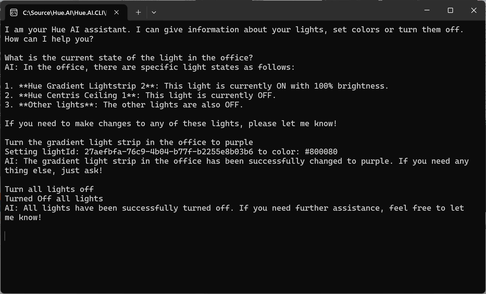

# Hue.AI
Experimenting with Hue and AI

This is a proof of concept for a Chat GPT like assistant that can give information about your Philips Hue lights and interact with lights (setting a color or tuning lights off).

## Tech
- .Net 9
- [Microsoft Semantic Kernel](https://github.com/microsoft/semantic-kernel) - [HueApi](https://github.com/michielpost/Q42.HueApi) library
- [Azure OpenAI](https://azure.microsoft.com/en-us/products/ai-services/openai-service)

## How to run?
This project uses Azure OpenAI and Philips Hue.
Update `appsettings.json` with your Azure OpenAI endpoint url, api key and deployment name.
Use a model that supports function calling, like `gpt-4o-mini`.
Also add the IP and Key of the Philips Hue Bridge in the config.

## Example usage
- What is the current state of the lights in my living room?
- Turn the light in the office to red.
- Turn all lights off.
- How many lights are on in the office?
- What type of lights are in the living room?

## Demo
Screenshot of a real life demo.

